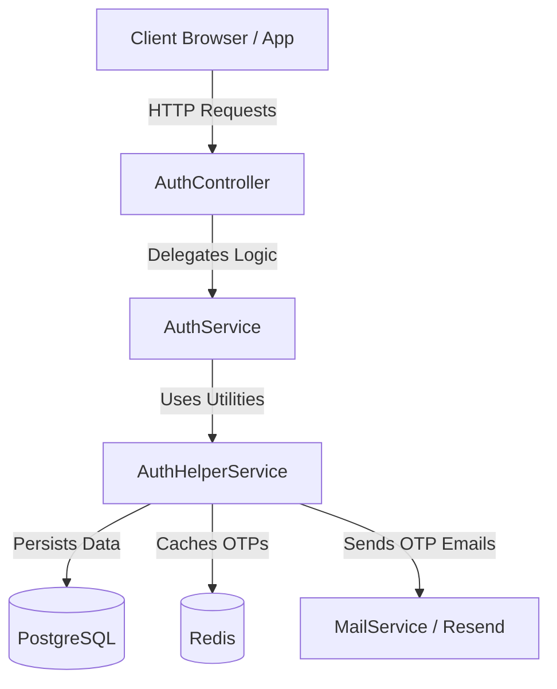
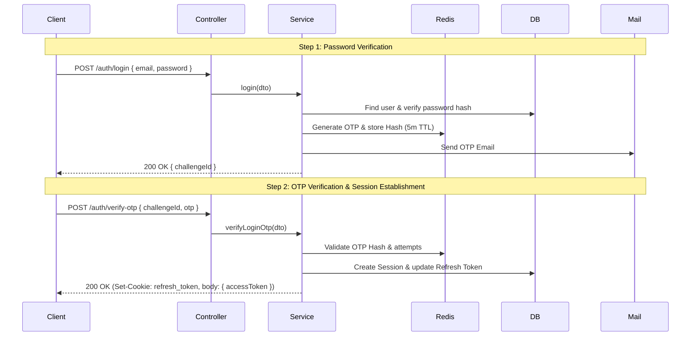

# Aayeshol Authentication Architecture & Reference

## A. Authentication System Overview

The Aayeshol authentication system is a robust, security-focused identity management module built on NestJS. It employs a **Two-Step OTP (One-Time Password) Authentication** mechanism for both user onboarding (email verification) and session establishment (2FA login).

### Major Components

- **Controllers (`AuthController`)**: Handle incoming HTTP REST requests, extract telemetry (IP, User-Agent, Request-ID), enforce DTO validation, and manage HTTP-only cookies.
- **Services (`AuthService`)**: Orchestrate business logic.
- **Helpers (`AuthHelperService`)**: Encapsulate reusable domain logic like OTP generation, Redis caching, JWT signing, database session transactions, and error handling.
- **Database (Prisma / PostgreSQL)**: Persists user profiles (`User`), credentials (`Account`), and active sessions (`Session`).
- **Cache (Redis)**: Manages ephemeral OTP challenges with automatic Time-to-Live (TTL) expiration and attempt tracking.
- **Mail (Resend)**: Dispatches unhashed OTP codes to users.

### Architecture Diagram



## B. Request Lifecycle & Architecture

Incoming requests follow the standard NestJS lifecycle:

1. **Middleware/Interceptors**: Extract telemetry and attach `RequestContext` (Request ID, IP, User-Agent).
2. **Guards**: `@Public()` routes bypass JWT validation. Protected routes use `JwtAuthGuard` to validate access tokens.
3. **Pipes**: Validate incoming JSON payloads against DTOs (`RegisterDto`, `LoginDto`, etc.).
4. **Controllers**: Receive validated requests and delegate to `AuthService`.
5. **Services**: Perform business logic synchronously, integrating with Prisma and Redis. Mail dispatch is handled asynchronously but awaited for delivery confirmation.

### Major Flow: Two-Step Login Sequence



## C. Implemented Authentication Flows

### 1. User Registration & Email Verification

- **Trigger**: User submits name, email, and password.
- **Process**: Creates an unverified `User` and `Account`. Hashes password (bcrypt, 12 rounds). Generates 6-digit OTP, stores hash in Redis (`auth:email-verify:{id}` - 15m), sends email.
- **Completion**: User submits OTP. System verifies hash, marks `isEmailVerified = true`, and deletes challenge.

### 2. Login (Two-Step Verification)

- **Step 1 Trigger**: User submits email and password.
- **Step 1 Process**: System verifies credentials and issues a login OTP. Redis stores hash (`auth:login-otp:{id}` - 5m).
- **Step 2 Trigger**: User submits `challengeId` and OTP.
- **Step 2 Process**: Validates OTP hash. Creates a `Session` in Postgres. Updates `Account.refreshToken` hash. Issues 8-minute JWT access token and 7-hour HTTP-only refresh token cookie.

### 3. Refresh Token Rotation

- **Trigger**: Access token expires; client calls `/auth/refresh`.
- **Process**: Validates HTTP-only cookie. Looks up `Session`. Verifies refresh token hash in `Account`. Issues new JWT and rotates the refresh token cookie.

### 4. Logout

- **Trigger**: Client calls `/auth/logout`.
- **Process**: Deletes the `Session` from Postgres using the session ID embedded in the JWT. Clears the HTTP-only refresh token cookie from the response.

### 5. Password Reset

- **Initiation**: Generates OTP and stores hash in Redis (`auth:password-reset:{id}` - 10m).
- **Completion**: Validates OTP and updates password hash in PostgreSQL.

## D. File Reference

| File                             | Responsibility                                                           |
| -------------------------------- | ------------------------------------------------------------------------ |
| `auth.controller.ts`             | Exposes REST endpoints, handles cookies, exacts `RequestContext`.        |
| `auth.service.ts`                | Core business logic orchestration for all auth flows.                    |
| `helpers/auth-helper.service.ts` | Centralized utility for OTPs, token signing, DB sessions, error mapping. |
| `decorators/public.decorator.ts` | Bypasses JWT authentication for specific routes.                         |
| `utils/otp.util.ts`              | Pure functions for OTP generation and SHA-256 hashing.                   |
| `utils/token.util.ts`            | Pure functions for refresh token generation and hashing.                 |
| `guards/jwt-auth.guard.ts`       | Evaluates JWT access tokens on protected routes.                         |

## E. Database, Redis, Tokens, and Sessions

### Database Schema (Prisma)

- **`User`**: Core profile (`email`, `emailVerified`, `name`).
- **`Account`**: Security credentials, separated for safety (`password` hashed, `refreshToken` hashed).
- **`Session`**: Tracks active sessions (`ipAddress`, `userAgent`, `expiresAt`) for audit and multi-device logout.

### Redis OTP Challenges

- **Format**: `auth:email-verify:{challengeId}`, `auth:login-otp:{challengeId}`
- **Payload**: `{ otpHash: string, expiresAt: number, attempts: number, email: string }`
- **Security**: Max 5 attempts. Stored using SHA-256 hashing (constant-time comparison).

### Tokens

- **Access Token**: JWT signed via `JwtService` (`sub`, `sessionId`, `purpose: 'access'`). Valid for 8 minutes.
- **Refresh Token**: High-entropy opaque string. Transmitted solely via `httpOnly`, `SameSite=Lax` cookie. Stored hashed in DB. Valid for 7 hours.

## F. Code Examples

### 1. Issuing a Login OTP (AuthService)

```typescript
const challengeId = await this.helper.issueLoginOtpChallenge(user.email, user.name, ctx);
this.logger.log(`Login OTP issued for user: ${user.id}`);
return successResponse('A verification code has been sent to your email.', { challengeId });
```

### 2. Validating OTP & Creating Session (AuthHelperService)

```typescript
// 1. Validate OTP from Redis
this.validateOtpChallenge(challenge, dto.otp, 'login');

// 2. Clear from Redis upon success
await this.redis.del(key, ctx);

// 3. Persist session transaction and generate tokens
const { accessToken, refreshToken } = await this.createSessionAndTokens(
  challenge.userId,
  ctx?.ipAddress,
  ctx?.userAgent,
);

// 4. Attach HTTP-only cookie
res.cookie(
  'refresh_token',
  refreshToken,
  getRefreshTokenCookieOptions(REFRESH_TOKEN_EXPIRY_MS, isProduction),
);
```

### 3. Extracting Request Context (AuthController)

```typescript
private getRequestContext(req: Request): RequestContext {
  return {
    requestId: (req.headers['x-request-id'] as string) ?? crypto.randomUUID(),
    ipAddress: (req.headers['x-forwarded-for'] as string)?.split(',')[0] ?? req.ip,
    userAgent: req.headers['user-agent'] ?? 'unknown',
  };
}
```

## G. API Reference

| Method | Route                       | Purpose                  | Auth   | Payload                             | Success Response               |
| ------ | --------------------------- | ------------------------ | ------ | ----------------------------------- | ------------------------------ |
| `POST` | `/api/auth/register`        | Create account           | Public | `{ name, email, password }`         | `201` + `challengeId`          |
| `POST` | `/api/auth/verify-email`    | Validate email           | Public | `{ challengeId, otp }`              | `200` + Confirmation           |
| `POST` | `/api/auth/login`           | Check password, send OTP | Public | `{ email, password }`               | `200` + `challengeId`          |
| `POST` | `/api/auth/verify-otp`      | Validate OTP, get tokens | Public | `{ challengeId, otp }`              | `200` + `accessToken` + Cookie |
| `POST` | `/api/auth/refresh`         | Rotate tokens            | Public | Cookie `refresh_token`              | `200` + `accessToken` + Cookie |
| `POST` | `/api/auth/forgot-password` | Send password reset OTP  | Public | `{ email }`                         | `200` + `challengeId`          |
| `POST` | `/api/auth/reset-password`  | Reset password using OTP | Public | `{ challengeId, otp, newPassword }` | `200` + Confirmation           |
| `POST` | `/api/auth/logout`          | Invalidate session       | JWT    | `None`                              | `200` + Cleared Cookie         |

## H. Error Handling and Security

- **Credential Validation**: Bcrypt (12 rounds) for passwords.
- **OTP Protection**: Raw OTPs are emailed but stored in Redis as SHA-256 hashes. Limited to 5 failed attempts per challenge.
- **Token Storage**: Refresh tokens are immune to XSS as they are `httpOnly`. Database stores hashes, preventing damage from DB leaks.
- **Error Obfuscation**: Generic error messages (`UnauthorizedException`) hide whether an email exists or a password failed.
- **Database Safety**: Prisma `P2002` (Unique Constraint) errors translate safely to HTTP 409 Conflict without leaking DB internals. Unhandled errors in production are masked.

## I. Environment Variables

| Variable            | Purpose                                                   | Safe Configuration             |
| ------------------- | --------------------------------------------------------- | ------------------------------ |
| `JWT_ACCESS_SECRET` | Signs short-lived access tokens.                          | High-entropy random string.    |
| `NODE_ENV`          | Toggles production error masking and secure cookie flags. | `production` or `development`. |

## J. Testing and Troubleshooting

### Troubleshooting Authentication Failures

1. **Invalid OTP**: Ensure the Redis server is running and TTLs have not expired.
2. **Refresh Token Rejection**: Check the `Account.isRevoked` flag in PostgreSQL or if the `Session` was prematurely deleted.
3. **Cookie Not Setting**: In local development, ensure you are testing over localhost or have configured SameSite correctly.
4. **Logs**: Trace requests via `requestId` in standard output, generated by `getRequestContext()`.

## K. End-to-End Example: Successful Login Flow

1. **Client POST `/auth/login`**: Submits `user@example.com` and password `Password123!`.
2. **Validation**: DTO pipes validate email format and password strength.
3. **Database Lookups**: `AuthService` queries Postgres. Bcrypt verifies the password.
4. **OTP Dispatch**: `AuthHelperService` generates `619372`, hashes it, saves to Redis, and sends via Resend. Returns UUID `challengeId`.
5. **Client POST `/auth/verify-otp`**: Submits `challengeId` and `619372`.
6. **Verification**: `AuthHelperService` fetches hash from Redis, validates it.
7. **Session Creation**: Prisma creates a `Session` record, updates `Account` with the refresh token hash.
8. **Response**: Client receives an 8-minute JWT in the body, and a 7-hour HTTP-only cookie.
